## Laboratorio #4 – REST API Blueprints (Java 21 / Spring Boot 3.3.x)
# Escuela Colombiana de Ingeniería – Arquitecturas de Software
# Carlos Duban Rojas y Juan Daniel Bogotá Fuentes

Informe de laboratorio documentando el desarrollo de la API REST de blueprints, enmarcado en los principios de SOA (bajo acoplamiento, abstracción de servicios, autonomía, ausencia de estado, facilidad de descubrimiento y compatibilidad con estándares) vistos en clase.

---

## 📋 Requisitos
- Java 21
- Maven 3.9+

## ▶️ Ejecución del proyecto
```bash
mvn clean install
mvn spring-boot:run
```
Probar con `curl`:
```bash
curl -s http://localhost:8080/blueprints | jq
curl -s http://localhost:8080/blueprints/john | jq
curl -s http://localhost:8080/blueprints/john/house | jq
curl -i -X POST http://localhost:8080/blueprints -H 'Content-Type: application/json' -d '{ "author":"john","name":"kitchen","points":[{"x":1,"y":1},{"x":2,"y":2}] }'
curl -i -X PUT  http://localhost:8080/blueprints/john/kitchen/points -H 'Content-Type: application/json' -d '{ "x":3,"y":3 }'
```

> Si deseas activar filtros de puntos (reducción de redundancia, *undersampling*, etc.), implementa nuevas clases que implementen `BlueprintsFilter` y cámbialas por `IdentityFilter` con `@Primary` o usando configuración de Spring.

---

Abrir en navegador:
- Swagger UI: [http://localhost:8080/swagger-ui.html](http://localhost:8080/swagger-ui.html)
- OpenAPI JSON: [http://localhost:8080/v3/api-docs](http://localhost:8080/v3/api-docs)

---

## 🗂️ Estructura de carpetas (arquitectura)

```
src/main/java/edu/eci/arsw/blueprints
  ├── model/         # Entidades de dominio: Blueprint, Point
  ├── persistence/   # Interfaz + repositorios (InMemory, Postgres)
  │    └── impl/     # Implementaciones concretas
  ├── services/      # Lógica de negocio y orquestación
  ├── filters/       # Filtros de procesamiento (Identity, Redundancy, Undersampling)
  ├── controllers/   # REST Controllers (BlueprintsAPIController)
  └── config/        # Configuración (Swagger/OpenAPI, etc.)
```

> Esta separación sigue el patrón **capas lógicas** (modelo, persistencia, servicios, controladores), facilitando la extensión hacia nuevas tecnologías o fuentes de datos.

---

## 📖 Actividades del laboratorio

### 1. Familiarización con el código base

- Revisa el paquete `model` con las clases `Blueprint` y `Point`.
- Entiende la capa `persistence` con `InMemoryBlueprintPersistence`.
- Analiza la capa `services` (`BlueprintsServices`) y el controlador `BlueprintsAPIController`.

**Model - El dominio**
- **Point:** es un record inmutable, dos coordenadas y sin lógica por el momento.
- **Blueprint:** representa un plano con autor, nombre y una lista de puntos. Cosas importantes: no tiene `id`, se identifica con `author + name`. Esta parte es clave al momento de migrar los datos a Postgres.
- El método `getPoints()` devuelve una lista inmutable — protege el encapsulamiento; para agregar puntos hay que usar `addPoint()`.

**Persistence - El contrato**
- `BlueprintPersistence` es una interfaz, no una clase.
- `InMemoryBlueprintPersistence` es la única implementación que hay. Se usa un `ConcurrentHashMap<String, Blueprint>` en memoria, con clave `"author:name"` y viene con 3 blueprints de ejemplo precargados.
- Es la pieza central de la arquitectura: nada más en el proyecto sabe que existe esta clase, el resto del sistema conoce solo la interfaz.

**Services - La lógica del negocio**
- Ahí se encuentra la inversión de dependencias: el constructor pide es la interfaz, no directamente las clases concretas. Spring decide en tiempo de ejecución cuál implementación inyectar.
- De aquí es que nos va a permitir, en la Actividad 2, cambiar a Postgres sin tocar esta clase.

**Controller - La capa REST**
- Por el momento expone 4 endpoints:
  - `GET /blueprints`
  - `GET /blueprints/{author}`
  - `GET /blueprints/{author}/{bpname}`
  - `POST /blueprints`
  - `PUT /blueprints/{author}/{bpname}/points`
- Cada uno atrapa sus excepciones de la capa de servicio (`BlueprintNotFoundException`, `BlueprintPersistenceException`) y las traduce a códigos HTTP. Hay que corregir algunos códigos porque, como están propuestos, no están del todo correctos.

**Flujo general:**
> Una petición HTTP llega al Controller, que llama a BlueprintServices, que llama a BlueprintPersistence, que devuelve un Blueprint del model.

### 2. Migración a persistencia en PostgreSQL
- Configura una base de datos PostgreSQL (puedes usar Docker).
- Implementa un nuevo repositorio `PostgresBlueprintPersistence` que reemplace la versión en memoria.
- Mantén el contrato de la interfaz `BlueprintPersistence`.
  
  Modificamos el application.properties para conectar con la DB que levantamos en Docker.
  
  Archivo Compose.yaml que genera el docker.

Añadimos la clase de PostgresBlueprintPersistence en la cual la dejamos aún como un repo, pero que se encarga de que todos los datos vayan a la DB de postgres.  

  
### 3. Buenas prácticas de API REST
- Cambia el path base de los controladores a `/api/v1/blueprints`.

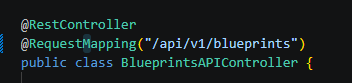

- Usa **códigos HTTP** correctos:
  - `200 OK` (consultas exitosas).

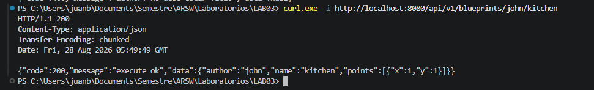

  - `201 Created` (creación).

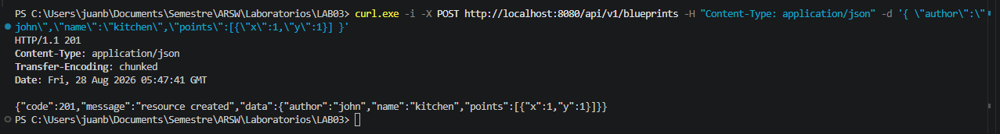

  - `202 Accepted` (actualizaciones).

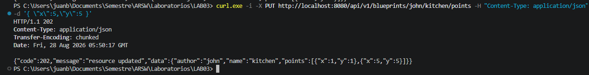

  - `400 Bad Request` (datos inválidos).

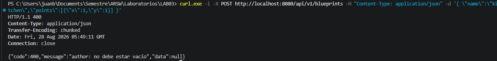

  - `404 Not Found` (recurso inexistente).

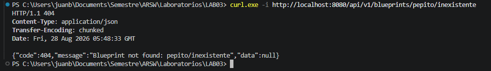

- Implementa una clase genérica de respuesta uniforme:
  ```java
  public record ApiResponse<T>(int code, String message, T data) {}
  ```

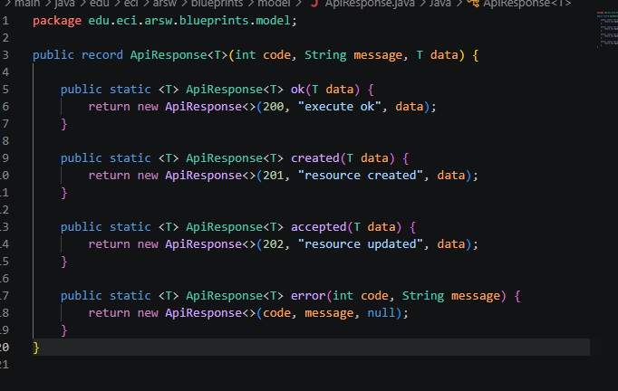

  Ejemplo JSON:
  ```json
  {
    "code": 200,
    "message": "execute ok",
    "data": { "author": "john", "name": "house", "points": [...] }
  }
  ```

El controller ya venía con el path versionado (/api/v1/blueprints) desde antes, pero los códigos de error no estaban del todo bien: el POST devolvía 403 FORBIDDEN cuando fallaba la persistencia (debía ser 400), y cada método tenía su propio try/catch devolviendo un Map.of("error", ...).

Creamos la clase ApiResponse<T> en model con métodos estáticos (ok, created, accepted, error) para no repetir la construcción del objeto en cada endpoint, y sacamos el manejo de excepciones del controller hacia un GlobalExceptionHandler con @RestControllerAdvice. Esto además nos permitió capturar MethodArgumentNotValidException (la de @Valid/@NotBlank), que antes no se manejaba y Spring devolvía su error genérico.

Con eso, cada endpoint quedó devolviendo ResponseEntity<ApiResponse<T>> en vez de ResponseEntity<?>, y el throws delega el manejo de errores a la clase encargada en lugar de tener el try/catch repetido en cada método.

### 4. OpenAPI / Swagger
- Configura `springdoc-openapi` en el proyecto.


Agregamos la dependencia springdoc-openapi-starter-webmvc-ui al pom.xml, que expone automáticamente /swagger-ui.html sin configuración adicional.


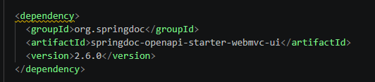

- Expón documentación automática en `/swagger-ui.html`.

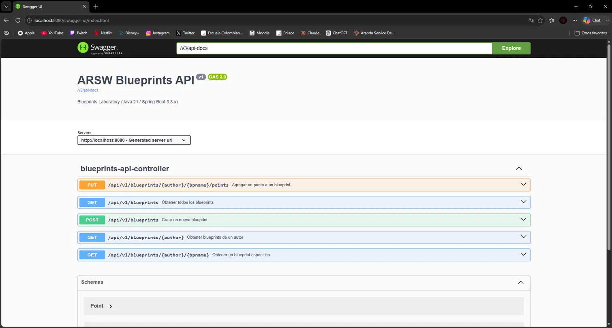
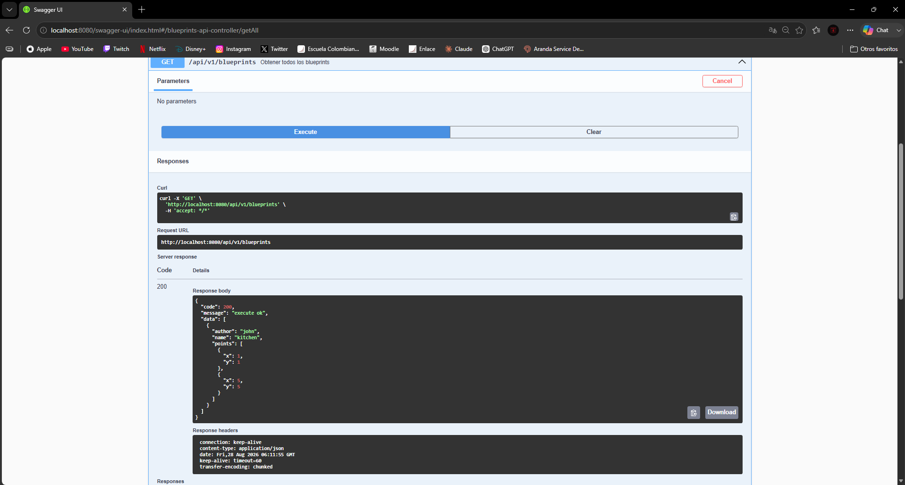

- Anota endpoints con `@Operation` y `@ApiResponse`.

Luego anotamos cada método del BlueprintsAPIController con @Operation(summary = ...) para que cada endpoint apareciera con una descripción clara en la UI en vez del nombre técnico del método. En el POST además agregamos dos @ApiResponse (los de Swagger, no los nuestros, tocó usar el nombre completo io.swagger.v3.oas.annotations.responses.ApiResponse porque ya teníamos una clase propia con ese mismo nombre) para documentar explícitamente los códigos 201 y 400 que puede devolver.

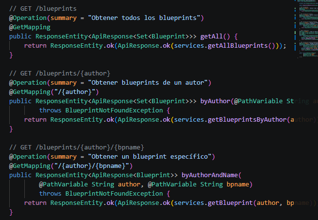

### 5. Filtros de *Blueprints*
- Implementa filtros:
  - **RedundancyFilter**: elimina puntos duplicados consecutivos.

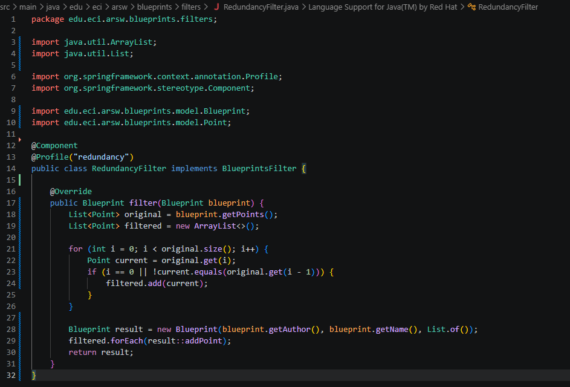

  - **UndersamplingFilter**: conserva 1 de cada 2 puntos.

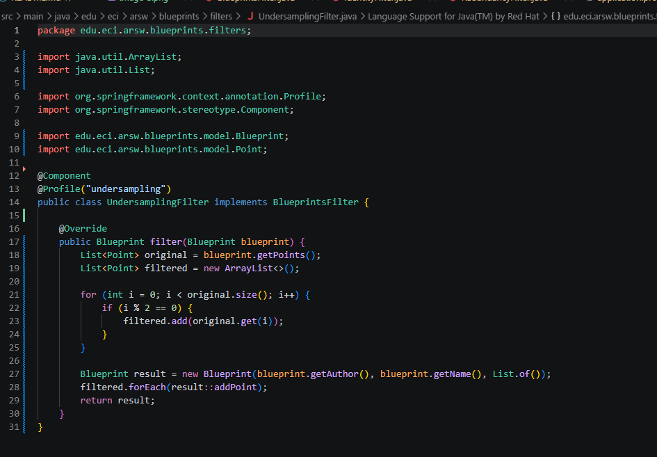

- Activa los filtros mediante perfiles de Spring (`redundancy`, `undersampling`).

- redundancy:
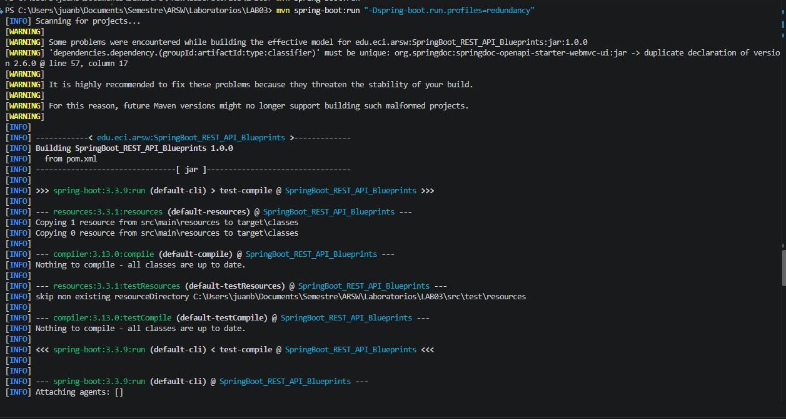
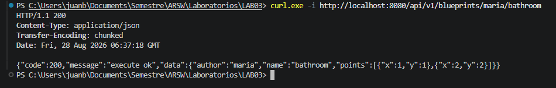
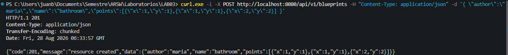

- undersampling:
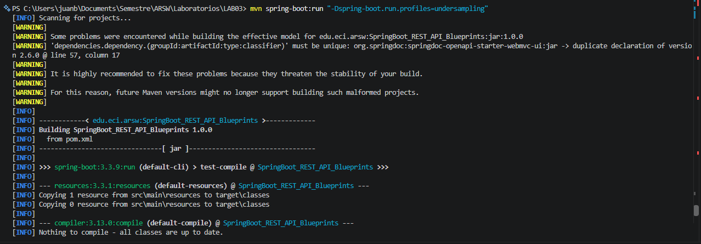 
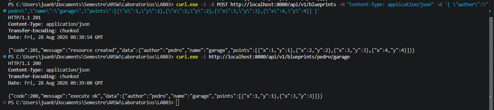


Para el punto 5 implementamos los filtros RedundancyFilter y UndersamplingFilter, que se activan mediante perfiles de Spring y se inyectan en BlueprintsServices a través de la interfaz BlueprintsFilter. Probamos ambos filtros con curl y funcionaron correctamente: el de redundancia eliminó los puntos duplicados consecutivos y el de undersampling dejó solo 1 de cada 2 puntos.

---

## ✅ Entregables

1. Repositorio en GitHub con:
   - Código fuente actualizado.
   - Configuración PostgreSQL (`application.yml` o script SQL).
   - Swagger/OpenAPI habilitado.
   - Clase `ApiResponse<T>` implementada.

2. Documentación:
   - Informe de laboratorio con instrucciones claras.
   - Evidencia de consultas en Swagger UI y evidencia de mensajes en la base de datos.
   - Breve explicación de buenas prácticas aplicadas.

---

## 📊 Criterios de evaluación

| Criterio | Peso |
|----------|------|
| Diseño de API (versionamiento, DTOs, ApiResponse) | 25% |
| Migración a PostgreSQL (repositorio y persistencia correcta) | 25% |
| Uso correcto de códigos HTTP y control de errores | 20% |
| Documentación con OpenAPI/Swagger + README | 15% |
| Pruebas básicas (unitarias o de integración) | 15% |

---
